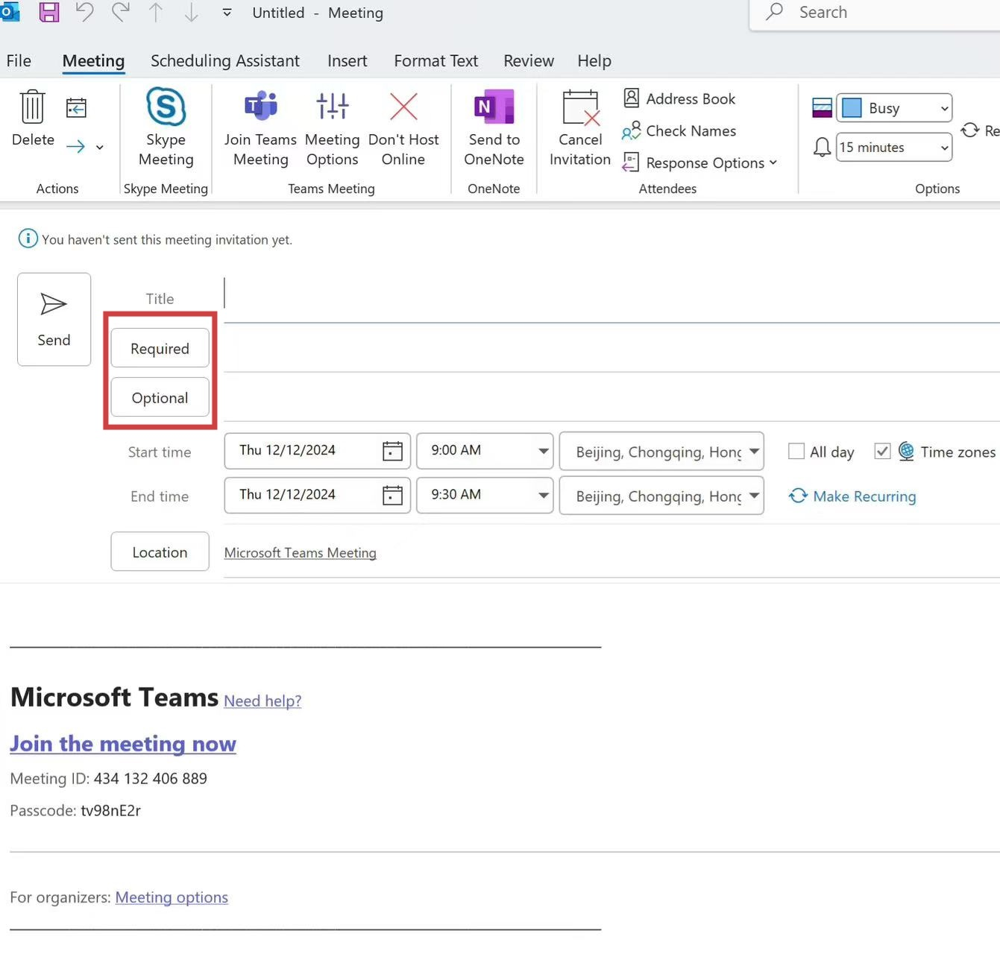

If you wish to organize a meeting that involves some of your colleagues and a client, instead of sending an email, send an appointment. Sending appointments is convenient because all the user has to do is click 'accept' and it is in their calendar.

<!--endintro-->

This way Outlook will remind your colleagues about the appointment and you can update them if any changes are made.

If the appointment is for **3 days or less**, send a separate appointment for each day. This is because multiple-day appointments appear at the top in your Outlook Calendar, so you risk missing the appointment (see below).

::: bad\
\
:::

::: good\
\
:::
